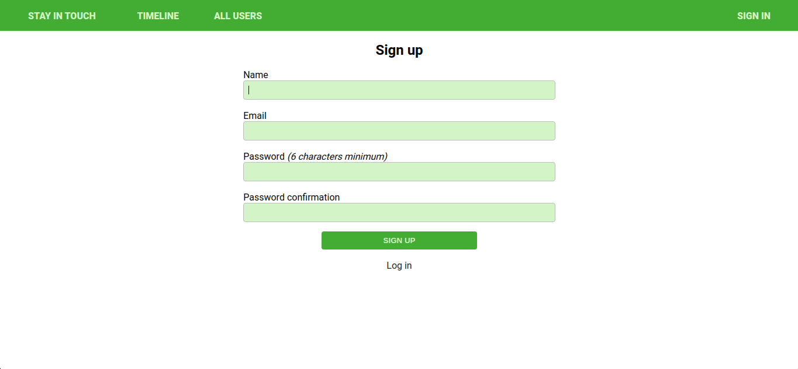
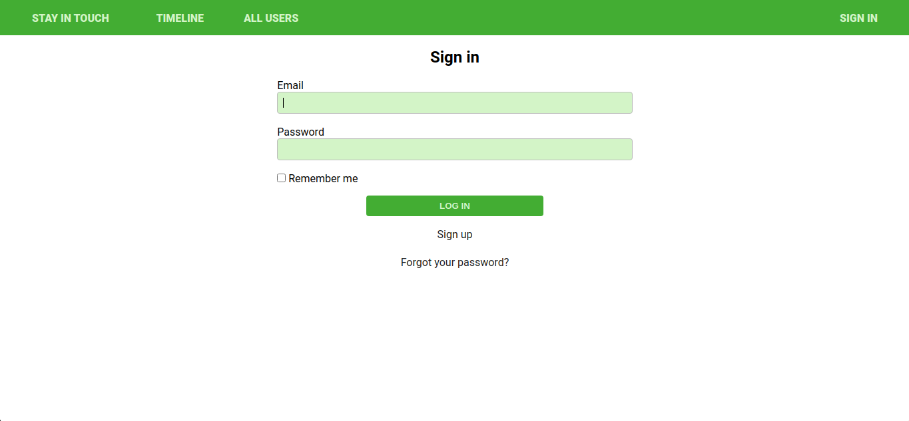
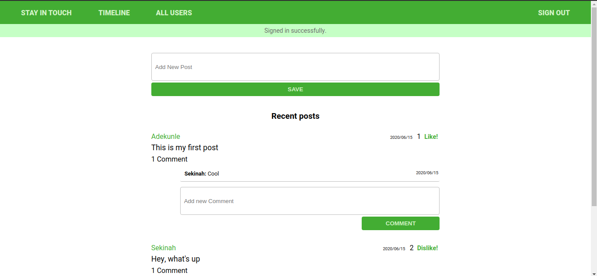
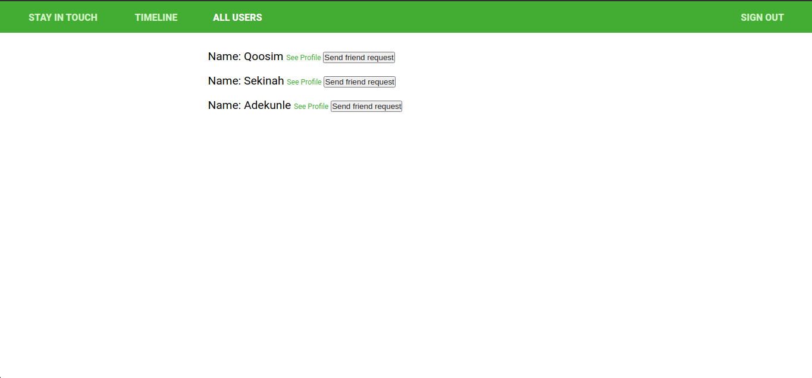

# 🔐 Social Media - Rolling My Own Social Media

This project is part of series of projects to be completed by students of [Microverse](https://www.microverse.org/).

In this project, I modified the forked repository <b><i>Social Media</i></b> in a way that a new user can create an account, sign in to his or her acount. A signed in user can view other users' posts, create posts, comment and likes on them. A user can send a friend request, cancel a friend request and confirm a friend request sent by another user.

***********

## 💻 Previews
Signup Page
  

Login Page
  

Profile Page
  

List of Users Page
  

## 🚚 Live Demo 

* [Social Media App](https://dashboard.heroku.com/apps/shielded-reef-53699)

## 🛠️ How to run the App

 - Prerequisites

Ruby: 2.7.1
Rails: 5.2.4
Postgres: >=9.5

- Install necessary gems with:
``` 
    bundle install
```
- Setup database with:

```
    rails db:create
    rails db:migrate
    rails db:seed
```

- Start server with:
    
```
    rails server
```

Visit `http://localhost:3000/` in your browser to play around the app.

## 🎉 Features

* New Users can create an account
* Users can log into the app
* Not logged in users can't access any post
* Logged in users can create new posts
* logged in users can comment and like any post
* Logged in users can send friend request to any user
* Logged in users can accept or reject friend requests
* Logged in users can cancel friend request sent
* User profile shows posts created by the user

## 🛠️ Built With

This project was built with Ruby on Rails
* [Ruby](https://www.ruby-lang.org/en/) v2.7.1
* [Rails](https://rubyonrails.org/) v5.2.4

Additional gems used
* Bootstrap v4.0
* [DatabaseCleaner](https://github.com/DatabaseCleaner/database_cleaner)
* [Shoulda Matchers](https://github.com/thoughtbot/shoulda-matchers)
* [Capybara](https://github.com/teamcapybara/capybara)

## 🧪 Testing
```
    rpsec
```

* Rspec model testing done for validations and associations
* Rspec controller testing for behaviour
* Rspec - Capybara testing for features

## 🕹️ Contributions, Issues & Forking

If you have any issues setting up the project or you come across any unintended bugs or problems, please do submit an issue to the [Social Media](https://github.com/Qoosim/ror-social-scaffold/issues) page.

If you want to make your own changes, modifications or improvements to this project, go ahead and Fork it!
1. [Fork it](https://github.com/Qoosim/ror-social-scaffold/fork)
2. Create your working branch (git checkout -b [choose-a-name])
3. Commit your changes (git commit -am 'what this commit will fix/add/improve')
4. Push to the branch (git push origin [chosen-name])
5. Create a new Pull Request

## 👨🏽‍💻 Author
**Qoosim AbdulGhaniyy**

- Github: [@Qoosim](https://github.com/Qoosim)
- Twitter: [@qoosim_ayinde](https://twitter.com/qoosim_ayinde)
- Linkedin: [qoosim_abdulghaniyy](https://www.linkedin.com/in/qoosim-abdulghaniyy)

## 🧴 Show Your Support

Give a ⭐️ if you like this project!
